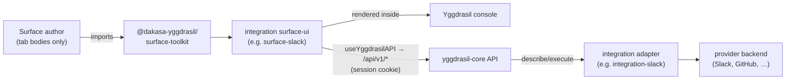
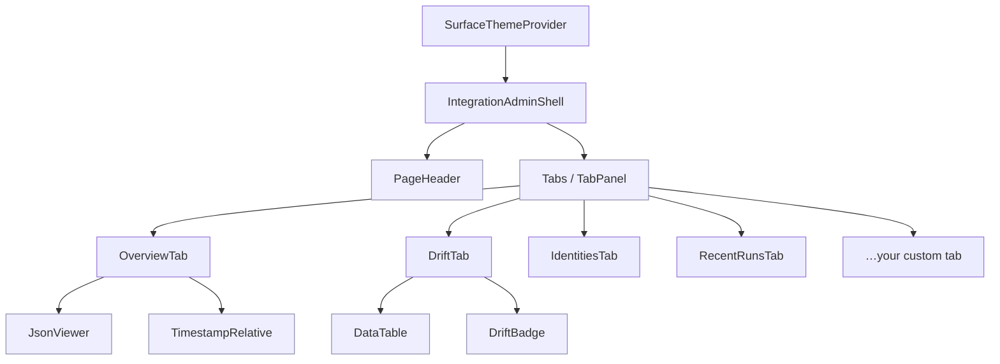

<div align="center">

# @dakasa-yggdrasil/surface-toolkit

**Shared React design system, hooks, and admin shells for Yggdrasil integration surfaces.**

[](./LICENSE)
[](./package.json)
[](https://react.dev)

One toolkit so every integration surface looks and behaves the same inside the Yggdrasil console · [Usage](./docs/USAGE.md) · [Components](./docs/COMPONENTS.md) · [Hooks](./docs/HOOKS.md) · [Development](./docs/DEVELOPMENT.md)

</div>

---

## What it is

`surface-toolkit` is the shared UI layer for **Yggdrasil surfaces** — the small React apps that give the operating company's internal team a console-ops view over a single integration (Slack, GitHub, Grafana, …). It ships three things every surface needs:

1. **Design tokens + theme** — an MUI theme (`SurfaceThemeProvider`) wired from a fixed palette, spacing scale, and the Inter type ramp, so all surfaces share one look.
2. **Admin shells** — `IntegrationAdminShell` (instance-centric) and `TeamContextShell` (team-centric) that own routing, tab layout, the instance picker, and the loading/empty/error states, so a surface author only writes the tab bodies.
3. **Data hooks** — React Query hooks (`useYggdrasilAPI`, `useInstance`, `useDriftStatus`, `useSurfaceQuery`, …) that talk to the Yggdrasil core API over the session cookie, plus pre-built tabs (`DriftTab`, `IdentitiesTab`, `RecentRunsTab`, …) built on top of them.

> **Yggdrasil — self-hosted control plane for declarative workflows + integrations over your whole stack.** Surfaces are its pluggable operator UIs; this toolkit is what keeps them consistent. See [yggdrasil-core](https://github.com/dakasa-yggdrasil/yggdrasil-core).

This package is a **published npm library**, not a deployable surface. It is consumed by surfaces scaffolded from `surface-template` / each integration's `surface-ui`.

## Where it fits in Yggdrasil

A surface is the slime; the toolkit is its skeleton. The surface imports the toolkit, mounts a shell, and renders inside the Yggdrasil console. Every API call goes back to **yggdrasil-core** over the delegated session — never directly to the provider.



## Component composition

`IntegrationAdminShell` wraps the design-system primitives and your tab bodies. The toolkit ships ready-made tabs you can drop straight into the `tabs` array.



## Public surface

Everything is re-exported from the package root (`@dakasa-yggdrasil/surface-toolkit`).

| Group | Exports | Reference |
|---|---|---|
| **Shells** | `IntegrationAdminShell`, `TeamContextShell`, `SurfaceThemeProvider`, `InstancePicker`, `surfaceTheme` | [COMPONENTS.md](./docs/COMPONENTS.md#shells) |
| **Design-system components** | `PageHeader`, `Tabs`, `TabPanel`, `DataTable`, `JsonViewer`, `LoadingState`, `EmptyState`, `ErrorBoundary`, `TimestampRelative`, `HealthBadge`, `DriftBadge`, `IdentityRow` | [COMPONENTS.md](./docs/COMPONENTS.md#design-system-components) |
| **Pre-built tabs** | `OverviewTab`, `DriftTab`, `IdentitiesTab`, `ActionsTab`, `RecentRunsTab`, `WebhookLogTab`, `ResourcesTab`, `TeamOverviewTab` | [COMPONENTS.md](./docs/COMPONENTS.md#pre-built-tabs) |
| **Icons** | `IntegrationIcon` | [COMPONENTS.md](./docs/COMPONENTS.md#icons) |
| **Hooks** | `useYggdrasilAPI`, `useSurfaceQuery`, `useInstance`, `useInstancesList`, `useDefaultInstance`, `useCurrentCollaborator`, `useTeam`, `useDriftStatus`, `useIdentities`, `useActionCatalog`, `useRecentRuns`, `useWebhookLog` | [HOOKS.md](./docs/HOOKS.md) |
| **Tokens** | `tokens`, `colors`, `spacing`, `typography`, `brand` | [COMPONENTS.md](./docs/COMPONENTS.md#design-tokens) |

## Install

This package is published to **GitHub Packages** under the `@dakasa-yggdrasil` scope. Point the scope at the GitHub registry first:

```bash
# .npmrc
@dakasa-yggdrasil:registry=https://npm.pkg.github.com
```

```bash
npm install @dakasa-yggdrasil/surface-toolkit
```

Peer dependencies (you provide these in the host surface):

| Peer | Range |
|---|---|
| `react` / `react-dom` | `^19.0.0` |
| `react-router-dom` | `^7.0.0` |
| `@tanstack/react-query` | `^5.0.0` |
| `@mui/material` | `^6.0.0` |
| `@emotion/react` / `@emotion/styled` | `^11.0.0` |

## Quick start

Wrap your surface once in the providers, then mount a shell against your router. The shell owns the URL contract `…/instance/:instanceId/:tabId`.

```tsx
import { BrowserRouter, Routes, Route } from "react-router-dom";
import { QueryClient, QueryClientProvider } from "@tanstack/react-query";
import {
  SurfaceThemeProvider,
  IntegrationAdminShell,
  InstancePicker,
  OverviewTab,
  DriftTab,
} from "@dakasa-yggdrasil/surface-toolkit";

const qc = new QueryClient();

const tabs = [
  { id: "overview", label: "Overview", component: OverviewTab },
  { id: "drift", label: "Drift", component: DriftTab },
];

export function App() {
  return (
    <QueryClientProvider client={qc}>
      <SurfaceThemeProvider>
        <BrowserRouter basename="/s/slack">
          <Routes>
            <Route
              path="/"
              element={
                <InstancePicker
                  integrationType="slack"
                  hrefForInstance={(id) => `/instance/${id}`}
                />
              }
            />
            <Route
              path="/instance/:instanceId/:tabId?"
              element={
                <IntegrationAdminShell
                  integrationType="slack"
                  basePath="/s/slack"
                  tabs={tabs}
                />
              }
            />
          </Routes>
        </BrowserRouter>
      </SurfaceThemeProvider>
    </QueryClientProvider>
  );
}
```

The full walkthrough — including a custom tab using `useSurfaceQuery` and the team-centric shell — lives in **[docs/USAGE.md](./docs/USAGE.md)**.

## How it talks to core

All hooks go through `useYggdrasilAPI`, which `fetch`es with `credentials: "include"` against a base URL of `/api/v1` (override via `useYggdrasilAPI({ baseUrl })`). Surfaces never reimplement auth — they ride the delegated Yggdrasil session cookie. Key endpoints the hooks read:

| Hook | Endpoint |
|---|---|
| `useInstance` / `useInstancesList` / `useDefaultInstance` | `GET /manifests?kind=integration_instance` |
| `useActionCatalog` | `GET /manifests?kind=integration_type` |
| `useCurrentCollaborator` | `GET /me` (dev fallback: `/collaborators/{slug}` + `/team-memberships`) |
| `useTeam` | `GET /teams/{id}` |
| `useDriftStatus` | `GET /ops/drift` |
| `useRecentRuns` / `useWebhookLog` | `GET /ops/audit` |
| `useIdentities` | `GET /collaborator-external-identities` |
| `useSurfaceQuery` | `POST /integrations/{instanceId}/surface-query` |

See **[docs/HOOKS.md](./docs/HOOKS.md)** for the per-hook signature, return shape, and caching.

## Development

```bash
npm ci
npm test        # vitest
npm run lint    # tsc --noEmit
npm run build   # vite lib build + d.ts
```

Build/publish details, the CI gates, and the release flow are in **[docs/DEVELOPMENT.md](./docs/DEVELOPMENT.md)**.

## Compatibility

- Built against **React 19**, **react-router-dom 7**, **@tanstack/react-query 5**, **MUI 6** (see peer deps above).
- Talks to the **yggdrasil-core** `/api/v1` surface. The endpoint shapes consumed by the hooks are documented in [HOOKS.md](./docs/HOOKS.md); if core changes a route, update the hook and the doc together.

## License

[Apache-2.0](./LICENSE)
</content>
</invoke>
